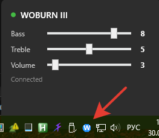

# WoburnEQ

A lightweight Windows tray application for controlling **Bass**, **Treble**, and **Volume** on Marshall Woburn III speakers via Bluetooth Low Energy (BLE).

Marshall does not provide a desktop app for EQ control — only a mobile app (iOS/Android). This project fills that gap by communicating directly with the speaker over BLE GATT, the same protocol the official app uses.

## Requirements

- Windows 10/11
- .NET 8 Runtime
- Bluetooth adapter with BLE support
- Marshall Woburn III paired via Bluetooth

Or launch `WoburnEQ.exe` from the publish output. The app appears as a blue **W** icon in the system tray.

## Compatibility

Tested on Marshall Woburn III (firmware 5.0.34). May work with other Marshall speakers that use the same BLE GATT service (`0000aa00`), but this has not been verified.

## License

MIT
